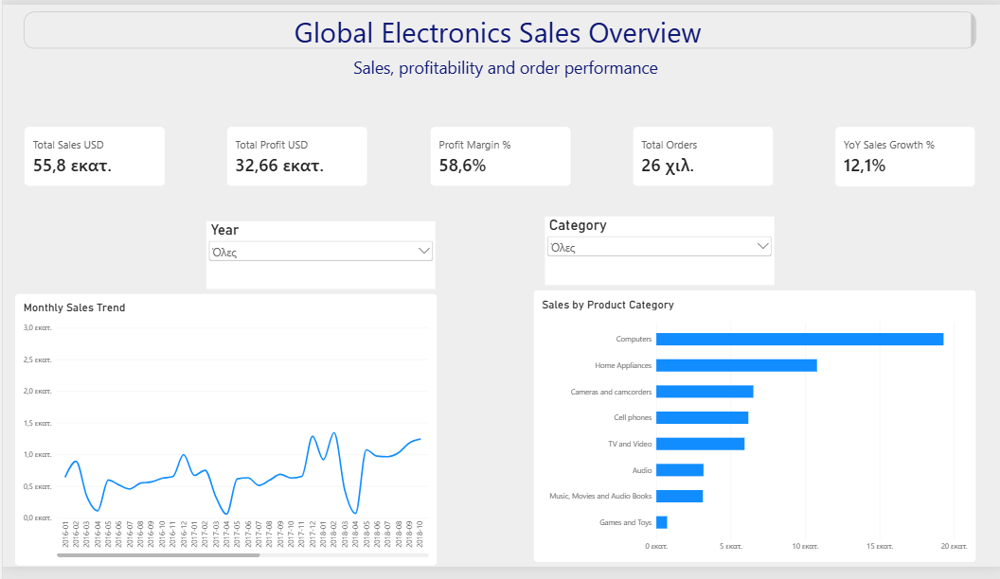
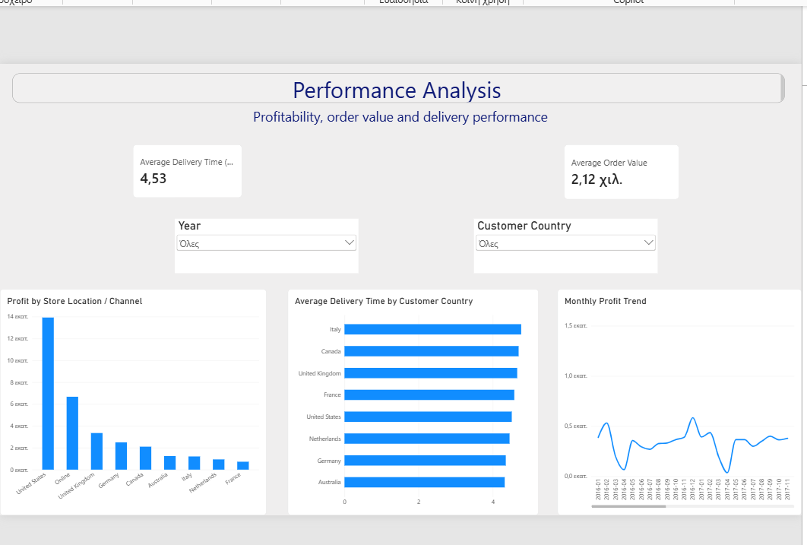
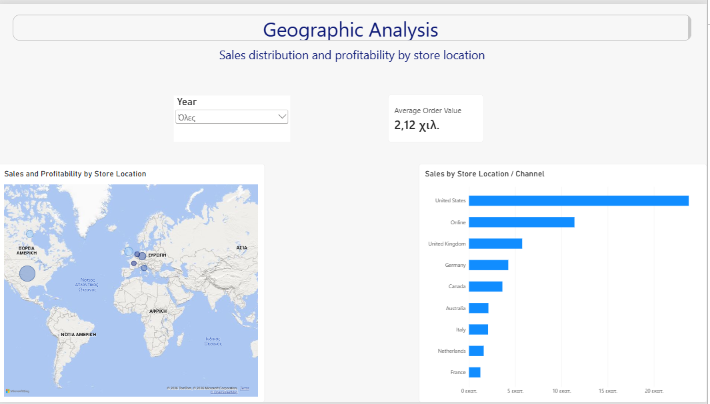
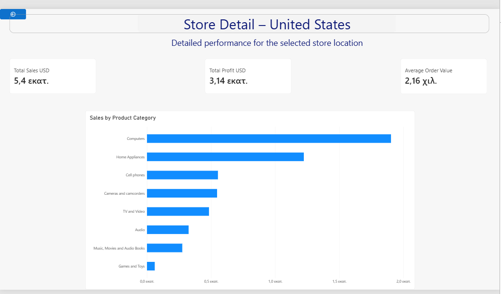
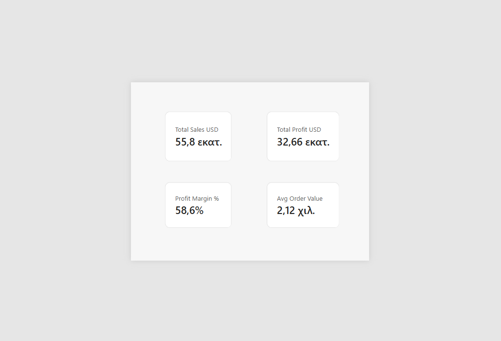

# Global Electronics Sales Analysis | Power BI
Power BI dashboard analyzing global electronics sales, profitability, product performance and store locations.

An interactive Power BI dashboard analyzing the sales performance of a global electronics retailer across products, customers, store locations and time.

The project covers the complete Power BI workflow, including data cleaning and transformation in Power Query, data modeling, DAX measures, time intelligence, interactive filtering, drill-down, drill-through and custom report page tooltips.

## Project Overview

The goal of this project is to explore the retailer's sales and profitability performance and provide an interactive report that allows users to analyze:

- Overall sales, profit and order performance
- Sales trends over time
- Product category performance
- Year-over-year sales growth
- Profitability by store location and sales channel
- Customer delivery performance
- Geographic sales distribution
- Detailed performance for individual store locations


## Dataset

The project uses the Maven Analytics Global Electronics Retailer dataset, which contains transactional and reference data for sales, customers, products, stores and exchange rates.

The main tables used in the Power BI model are:

- `Sales` – transactional sales data, including order dates, quantities, customers, stores and products
- `Customers` – customer demographic and geographic information
- `Products` – product details, categories, prices and costs
- `Stores` – store locations and store characteristics
- `Exchange_Rates` – historical currency exchange rates
- `DateTable` – a custom calendar table created in DAX for time-based analysis and year-over-year calculations


## Data Preparation

Data cleaning and transformation were performed in Power Query before loading the data into the model.

Key preparation steps included:

- Correcting data types across all tables
- Parsing date fields using the appropriate locale
- Converting currency fields to numeric values
- Handling missing delivery dates
- Creating a `Delivery Days` column
- Creating a composite `ExchangeKey` for the exchange-rate relationship
- Validating column quality and checking for errors


## Data Model

The report uses a star-schema-style data model centered around the `Sales` table.

Key relationships include:

- `Customers[CustomerKey]` → `Sales[CustomerKey]`
- `Products[ProductKey]` → `Sales[ProductKey]`
- `Stores[StoreKey]` → `Sales[StoreKey]`
- `DateTable[Date]` → `Sales[Order Date]`
- `Exchange_Rates[ExchangeKey]` → `Sales[ExchangeKey]`

The `DateTable` supports time intelligence calculations, while the `ExchangeKey` was created as a composite key to connect sales transactions with historical exchange-rate data.


## DAX Measures

Several DAX measures were created to support the analysis, including:

- `Total Sales USD`
- `Total Cost USD`
- `Total Profit USD`
- `Profit Margin %`
- `Total Orders`
- `Average Order Value`
- `Average Delivery Days`
- `Sales Previous Year`
- `YoY Sales Growth %`

Example:

```DAX
Total Profit USD =
[Total Sales USD] - [Total Cost USD]
```
```DAX
YoY Sales Growth % =
DIVIDE(
    [Total Sales USD] - [Sales Previous Year],
    [Sales Previous Year]
)
```


## Dashboard Features

The report includes several interactive Power BI features:

- Year and category slicers for dynamic filtering
- Drill-down hierarchy from `Country` to `State`
- Drill-through navigation to a dedicated `Store Detail` page
- Dynamic page title based on the selected store location
- Custom report page tooltip with key performance indicators
- Interactive geographic map with sales and profitability information
- Time intelligence using previous-year sales and year-over-year growth


## Report Pages

### Overview
High-level view of sales, profit, profit margin, orders, year-over-year growth, monthly sales trends and product category performance.

### Performance Analysis
Focuses on profitability, average order value and customer delivery performance across time and locations.

### Geographic Analysis
Shows geographic sales distribution, store-location performance and hierarchical drill-down from country to state.

### Store Detail
A drill-through page providing detailed performance for the selected store location, including sales, profit, average order value and product category breakdown.


## Dashboard Screenshots

### Overview


### Performance Analysis


### Geographic Analysis


### Store Detail


### Toolip

